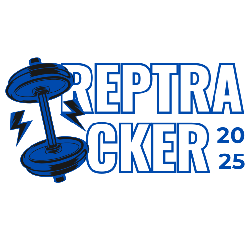

# 🏋️‍♂️ RepTracker - AI-Powered Fitness Coach

An intelligent fitness tracking application that provides personalized workout plans and real-time coaching using advanced AI technology.


## ✨ Features

- 🤖 **AI-Powered Coaching**: Get personalized workout recommendations and real-time feedback
- 📊 **Progress Tracking**: Monitor your fitness journey with detailed analytics
- 🎯 **Custom Workout Plans**: Tailored exercise routines based on your goals and fitness level
- 🔐 **Secure Authentication**: User management with Clerk authentication
- 📱 **Responsive Design**: Works seamlessly on desktop and mobile devices
- 🎙️ **Voice Integration**: Interactive voice coaching with VAPI
- 💾 **Real-time Database**: Powered by Convex for instant data synchronization

## 🚀 Tech Stack

- **Frontend**: Next.js 14, React, TypeScript, Tailwind CSS
- **Backend**: Convex (Real-time database)
- **Authentication**: Clerk
- **Voice AI**: VAPI (Voice AI Platform Integration)
- **UI Components**: Radix UI, Shadcn/ui
- **Deployment**: Vercel, Docker

## 📦 Installation

### Prerequisites

- Node.js 18+ 
- npm or yarn
- Git

### Local Development

1. **Clone the repository**
   ```bash
   git clone https://github.com/Emon3469/RepTracker-AI-Powered-Fitness-Coach.git
   cd RepTracker-AI-Powered-Fitness-Coach
   ```

2. **Install dependencies**
   ```bash
   npm install
   ```

3. **Set up environment variables**
   Create a `.env.local` file in the root directory:
   ```env
   # Convex
   CONVEX_DEPLOYMENT=your_convex_deployment_url
   NEXT_PUBLIC_CONVEX_URL=your_convex_url

   # Clerk Authentication
   NEXT_PUBLIC_CLERK_PUBLISHABLE_KEY=your_clerk_publishable_key
   CLERK_SECRET_KEY=your_clerk_secret_key
   NEXT_PUBLIC_CLERK_SIGN_IN_URL=/sign-in
   NEXT_PUBLIC_CLERK_SIGN_UP_URL=/sign-up

   # VAPI (Voice AI)
   NEXT_PUBLIC_VAPI_PUBLIC_KEY=your_vapi_public_key
   VAPI_PRIVATE_KEY=your_vapi_private_key
   ```

4. **Run the development server**
   ```bash
   npm run dev
   ```

5. **Open your browser**
   Navigate to [http://localhost:3000](http://localhost:3000)

## 🐳 Docker Deployment

### Using Docker Compose (Recommended)

```bash
# Build and run with Docker Compose
docker-compose up --build

# Run in detached mode
docker-compose up -d --build
```

### Using Docker directly

```bash
# Build the image
docker build -t reptracker .

# Run the container
docker run -p 3000:3000 reptracker
```

## ☁️ Cloud Deployment

### Vercel (Recommended)

1. Fork this repository
2. Connect your GitHub account to Vercel
3. Import the project
4. Add environment variables in Vercel dashboard
5. Deploy automatically

[](https://vercel.com/new/clone?repository-url=https://github.com/Emon3469/RepTracker-AI-Powered-Fitness-Coach)

### Render

1. Connect your GitHub repository
2. Set build command: `npm install && npm run build`
3. Set start command: `npm start`
4. Add environment variables
5. Deploy

## 📁 Project Structure

```
reptracker/
├── src/
│   ├── app/                    # Next.js app directory
│   │   ├── (auth)/            # Authentication pages
│   │   ├── generate-program/   # AI program generation
│   │   ├── profile/           # User profile
│   │   └── globals.css        # Global styles
│   ├── components/            # React components
│   │   ├── ui/               # UI components
│   │   ├── Navbar.tsx        # Navigation
│   │   ├── Footer.tsx        # Footer
│   │   └── ...
│   ├── lib/                  # Utility functions
│   ├── constants/            # App constants
│   └── providers/            # Context providers
├── public/                   # Static assets
├── convex/                   # Convex backend functions
├── Dockerfile               # Docker configuration
├── docker-compose.yml       # Docker Compose setup
└── vercel.json             # Vercel deployment config
```

## 🔧 Configuration

### Environment Variables

| Variable | Description | Required |
|----------|-------------|----------|
| `CONVEX_DEPLOYMENT` | Convex deployment URL | ✅ |
| `NEXT_PUBLIC_CONVEX_URL` | Public Convex URL | ✅ |
| `NEXT_PUBLIC_CLERK_PUBLISHABLE_KEY` | Clerk public key | ✅ |
| `CLERK_SECRET_KEY` | Clerk secret key | ✅ |
| `NEXT_PUBLIC_VAPI_PUBLIC_KEY` | VAPI public key | ✅ |
| `VAPI_PRIVATE_KEY` | VAPI private key | ✅ |

## 🤝 Contributing

1. Fork the repository
2. Create a feature branch (`git checkout -b feature/amazing-feature`)
3. Commit your changes (`git commit -m 'Add amazing feature'`)
4. Push to the branch (`git push origin feature/amazing-feature`)
5. Open a Pull Request

## 📄 License

This project is licensed under the MIT License - see the [LICENSE](LICENSE) file for details.

## 👨‍💻 Author

**Emon Hossain**
- GitHub: [@Emon3469](https://github.com/Emon3469)
- LinkedIn: [Connect with me](https://linkedin.com/in/emon-hossain)

## 🙏 Acknowledgments

- [Next.js](https://nextjs.org/) for the amazing React framework
- [Convex](https://convex.dev/) for real-time backend infrastructure
- [Clerk](https://clerk.dev/) for authentication services
- [VAPI](https://vapi.ai/) for voice AI integration
- [Vercel](https://vercel.com/) for seamless deployment

---

⭐ **Star this repository if you found it helpful!**


